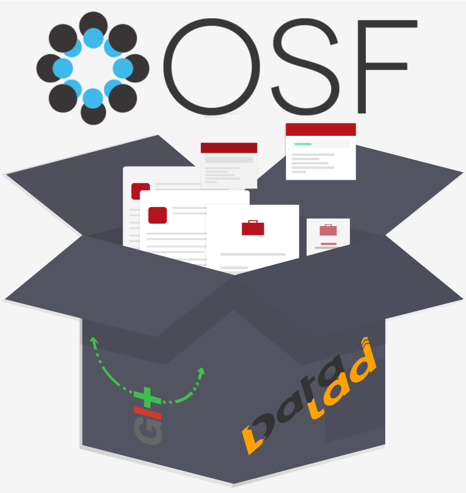

.. include:: ./links.inc

DataLad-OSF: Opening up the Open Science Framework for DataLad
--------------------------------------------------------------

This `DataLad extension <handbook.datalad.org/en/latest/r.html?extensions>`_ enables DataLad_ to work with the Open Science Framework (OSF_).
Use it to publish your dataset's data to an OSF project to utilize the OSF for dataset data storage and share and collaborate on datasets.

The extension was created during the `OHBM Hackathon 2020 <https://ohbm.github.io/hackathon2020/>`_ and wouldn't have been possible without a `dedicated team of volunteers <https://github.com/datalad/datalad-osf#contributors->`_.
If you want to get in touch or on board as well, please see our :ref:`contributing guidelines <contribute>`.

Documentation overview
^^^^^^^^^^^^^^^^^^^^^^

.. toctree::
   :maxdepth: 2

   intro
   settingup
   tutorial
   contributing
   acknowledgements

.. toctree::
   :maxdepth: 1

   cmd
   api
   git-annex-utils

Indices and tables
^^^^^^^^^^^^^^^^^^

* :ref:`genindex`
* :ref:`modindex`
* :ref:`search`

.. |---| unicode:: U+02014 .. em dash
