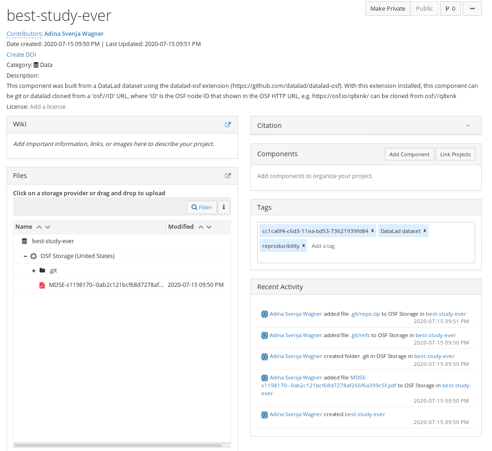

.. include:: ../links.inc

Use case 1: Publishing and cloning datasets
^^^^^^^^^^^^^^^^^^^^^^^^^^^^^^^^^^^^^^^^^^^

.. admonition:: Problem statement

    Imagine you have been creating a reproducible workflow using DataLad_ from the
    get go. Everything is finished now, code, data, and paper are ready. Last thing
    to do: Publish your data, code, results, and workflows -- ideally, all together, easily accessible, and also fast.

    The solution: Publish the complete dataset to the OSF and let others clone the project to get access to data, code, version history, and workflows.
    Therefore, you decide on the ``annex`` sibling mode.

Creating the OSF sibling
""""""""""""""""""""""""

Given OSF credentials are set, we can create a sibling in ``annex`` mode.
We will also make the project public (``--public``), and attach some meta data (``--category``, ``--tag``) to it.

The code below will create a new public OSF project called ``best-study-ever``, a dataset sibling called ``osf-annex``, and a readily configured storage sibling ``osf-annex-storage``.
The project on the OSF will have a description with details on how to clone it and some meta data.

.. code-block:: bash

   # inside of the tutorial DataLad dataset
   $ datalad create-sibling-osf --title best-study-ever \
     -s osf-annex \
     --category data \
     --tag reproducibility \
     --public

   create-sibling-osf(ok): https://osf.io/<id>/
   [INFO   ] Configure additional publication dependency on "osf-annex-storage"
   configure-sibling(ok): /tmp/collab_osf (sibling)

Publishing the dataset
""""""""""""""""""""""

Afterwards, all that's left to do is a ``datalad push`` to publish the dataset to the OSF.

.. code-block:: bash

   $ datalad push --to osf-annex

The resulting dataset has all data and its Git history, but is not as human-readable as on a local computer:

Cloning the dataset
"""""""""""""""""""

The dataset can be cloned with an ``osf://<id>`` URL, where ID is the project ID assigned at project creation:

.. code-block:: bash

   $ datalad clone osf://n6bgd/ best-study-ever
     install(ok): /tmp/best-study-ever (dataset)

All data can subsequently be obtained using ``datalad get``.