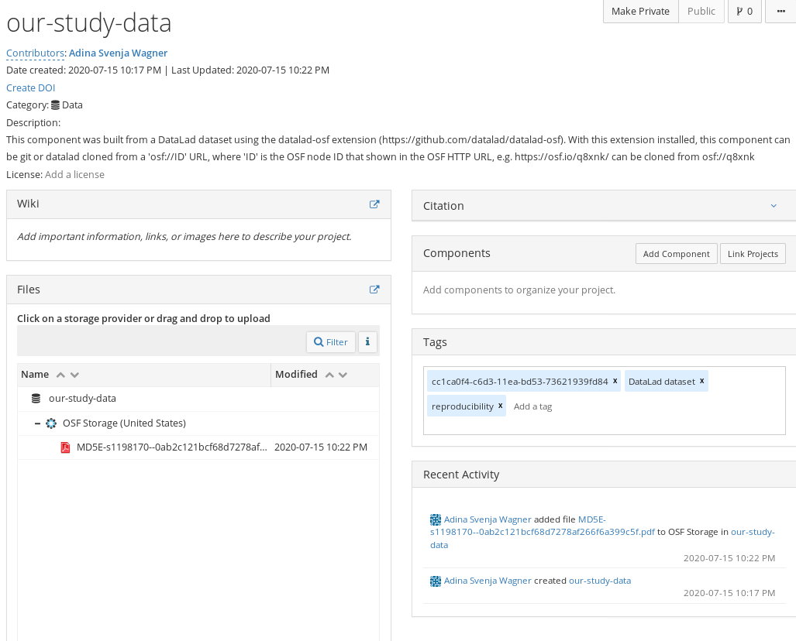

.. include:: ../links.inc

Use case 3: Using the OSF as a data store for a GitHub-based project
^^^^^^^^^^^^^^^^^^^^^^^^^^^^^^^^^^^^^^^^^^^^^^^^^^^^^^^^^^^^^^^^^^^^

.. admonition:: Problem statement

   Imagine you are a PhD student and want to collaborate on a fun little side project with a student at another institute.
   You agree that your code will be hosted on GitHub_ due to its easier accessibility and greater feature selection.
   But what about the data you are collecting?
   The Dropbox is already full (`DataLad third party providers <http://handbook.datalad.org/en/latest/basics/101-138-sharethirdparty.html>`_).
   And Amazon services don't seem to be your best alternative.
   Suddenly you remember, that you got an OSF_ account recently: You decide to publish your dataset to GitHub_ and your data to the OSF_ and link both via a publication dependency.

   Therefore, you go with a sibling in ``annex`` mode.
   While others *can* clone it from the OSF, you mostly utilize it for data access. Others clone the dataset from GitHub and are unaware where your data is stored.

Creating the OSF sibling
""""""""""""""""""""""""

Given OSF credentials are set, we can create a sibling in ``annex`` mode.

As in use case 1, the code below will create a new public OSF project called ``our-study-data``, a dataset sibling called ``osf-annex2``, and a readily configured storage sibling ``osf-annex2-storage``.

.. code-block:: bash

   # inside of the tutorial DataLad dataset
   $ datalad create-sibling-osf --title our-study-data \
     -s osf-annex2 \
     --category data \
     --tag reproducibility \
     --public

   create-sibling-osf(ok): https://osf.io/<id>/
   [INFO   ] Configure additional publication dependency on "osf-annex2-storage"
   configure-sibling(ok): /tmp/collab_osf (sibling)

Creating a sibling on GitHub
""""""""""""""""""""""""""""

As the goal is to use OSF for data storage and expose the dataset also via GitHub, we're not done yet.
We can set-up a GitHub Remote with name ``github`` and include a publication dependency to the OSF storage sibling -- that way, when we publish our dataset to GitHub, the data files get automatically uploaded to OSF.

.. code-block:: bash

    $ datalad create-sibling-github our-study-data \
      -s github \
      --github-login LOGIN \
      --publish-depends osf-annex2-storage

    You need to authenticate with '<login>@github' credentials. https://github.com/login provides information on how to gain access
    password: <password>
    You need to authenticate with '<login>@github' credentials. https://github.com/login provides information on how to gain access
    password (repeat): <password>
    [INFO   ] Configure additional publication dependency on "osf-annex2-storage"
    .: github(-) [https://<login>@github.com/<login>/our-study-data.git (git)]
    'https://<login>@github.com/<login>/our-study-data.git' configured as sibling 'github' for Dataset(/tmp/collab_osf)

Publish the dataset to GitHub and its data to OSF
"""""""""""""""""""""""""""""""""""""""""""""""""

Because a publication dependency to the OSF is set up, a ``datalad push`` to GitHub is sufficient.

.. code-block:: bash

    $ datalad push --to github
      Push to 'github':  [...]           | 1.00/4.00 [00:00<00:00, 25.9k Steps/s]
      Password for 'https://adswa@github.com': <password>
      copy(ok): /tmp/collab_osf/books/bash_guide.pdf (file) [to osf-annex2-storage...]
      Push to 'github': [...]           | 1.00/4.00 [00:33<01:41, 33.9s/ Steps]
      Update availability for 'github':  [...] | 3.00/4.00 [00:00<00:00, 60.5k Steps/s]
      Password for 'https://adswa@github.com': <password>
      publish(ok): /tmp/collab_osf (dataset) [refs/heads/master->github:refs/heads/master [new branch]]
      Update availability for 'github':  [...] | 3.00/4.00 [00:15<00:05, 5.27s/ Steps]
      Publish(ok): /tmp/collab_osf (dataset) [refs/heads/git-annex->github:refs/heads/git-annex [new branch]]
      Update availability for 'github': [...] | 3.00/4.00 [00:15<00:05, 5.27s/ Steps]

Afterwards, the dataset can be cloned from GitHub.
For a user, the experience will feel similar to use case 1: After cloning, the files in Git and all dataset history are available, all data stored in the annex is retrieved upon ``datalad get``.
The file content, though, will be retrieved from the OSF, which now serves as a data store for the GitHub repository.

This way you can let OSF handle your data, but still use GitHub to expose your dataset.
