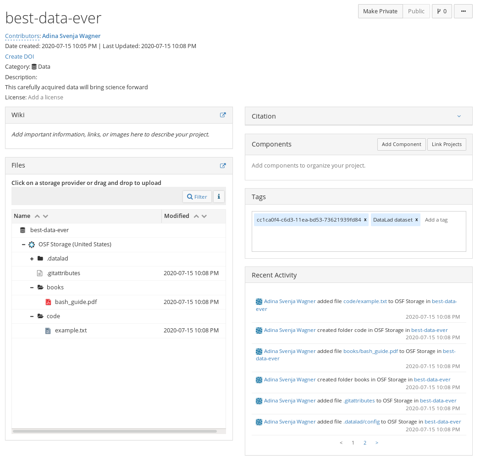

.. include:: ../links.inc
.. _export:

Use case 2: Export a human-readable dataset to OSF
^^^^^^^^^^^^^^^^^^^^^^^^^^^^^^^^^^^^^^^^^^^^^^^^^^

.. admonition:: Problem statement

    Imagine you have been collecting data and want to share it with others.
    All your colleagues have only sparse experience with the command line, but are frequent OSF users.
    Therefore, you place all data in a dataset and export the latest version of your data to the OSF in a human readable way, for others to view it conveniently in the web interface.

    As you want a human-readable representation and decide to not share the version history, but only the most recent state of the data, you pick the ``exportonly`` sibling mode.

Creating the OSF sibling
""""""""""""""""""""""""

Given OSF credentials are set, we can create a sibling in ``export-only`` mode.
We will also make the project public (``--public``), and attach a custom description (``--description``) to it.

The code below will create a new public OSF project called ``best-data-ever``, a dataset sibling called ``osf-exportonly-storage``. This sibling is a sole storage sibling -- in technical terms, a git-annex_ `special remote`_ -- and can only be used with pure git-annex commands.

.. code-block:: bash

   # inside of the tutorial DataLad dataset
   $ datalad create-sibling-osf --title best-data-ever \
     --mode exportonly \
     -s osf-export \
     --description "This carefully acquired data will bring science forward" \
     --public

   create-sibling-osf(ok): https://osf.io/<id>/
   # note that the sibling name as an appended "storage" suffix!
   $ datalad siblings
    .: here(+) [git]
    .: osf-annex(-) [osf://n6bgd (git)]
    .: osf-export-storage(+) [osf]          # created in this example
    .: osf-annex-storage(+) [osf]

Publishing the dataset
""""""""""""""""""""""

In ``exportonly`` mode, the only way to publish data is via ``git annex export`` (more on this command `here <https://git-annex.branchable.com/git-annex-export/>`_).
This command is a pure git-annex_ command and can export a *tree* (a branch, tag, or any other tree-ish accepted by Git including e.g., ``master:subdir``) to the OSF without obscuring filenames.

To export the current state (the ``HEAD``) of the dataset with this command we run:

.. code-block:: bash

    $ git-annex export HEAD --to osf-export-storage
      export osf-export-storage .datalad/.gitattributes
      ok
      export osf-export-storage .datalad/config
      ok
      export osf-export-storage .gitattributes
      ok
      export osf-export-storage books/bash_guide.pdf
      ok
      export osf-export-storage code/example.txt
      ok
      (recording state in git...)

The resulting project has a human readable structure, and all its data can be viewed and downloaded via the OSF interface.
It is not possible to clone this dataset with DataLad, however potential users can still download it from the standard OSF interface.

