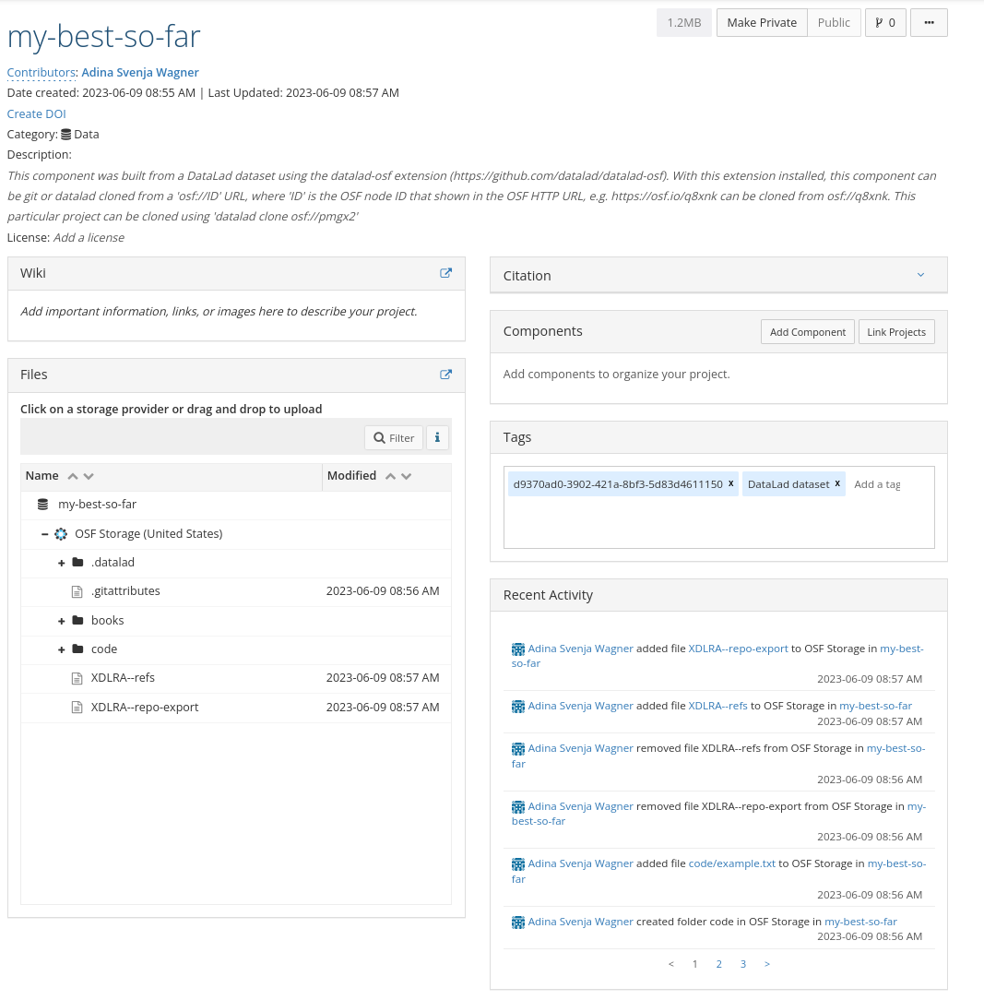

.. include:: ../links.inc
.. _exportmode:

Usecase 4: --mode export, The best of both worlds
^^^^^^^^^^^^^^^^^^^^^^^^^^^^^^^^^^^^^^^^^^^^^^^^^

By now, we've seen several different modes:
The ``annex`` mode creates a clone-able dataset with version history on the OSF, but it is not human readable.
The ``exportonly`` mode creates a human-readable snapshot on the OSF, but it is not clone-able and has no version history.

The best-of-both-worlds compromise between these modes is the ``export`` mode:
It creates a human readable snapshot on the OSF.
This snapshot can be cloned, and it includes the datasets version history.
However, only the latest version of annexed data is available.

Creating the OSF sibling
""""""""""""""""""""""""

Given OSF credentials are set, we can create a sibling in ``export`` mode. We will also make the project public (--public), and attach category metadata.

.. code-block:: bash

   $ datalad create-sibling-osf --title my-best-so-far \
     -s osf-export \
     --mode export \
     --public \
     --category data

Publishing the dataset
""""""""""""""""""""""

Next, we can push revision history and export a snapshot of all files.

.. code-block:: bash

   $ datalad push --to osf-export
	copy(ok): .datalad/.gitattributes (dataset)
	copy(ok): .datalad/config (dataset)
	copy(ok): .gitattributes (dataset)
	copy(ok): books/bash_guide.pdf (dataset)
	copy(ok): code/example.txt (dataset)
	publish(ok): . (dataset) [refs/heads/master->osf-export:refs/heads/master [new branch]]
	publish(ok): . (dataset) [refs/heads/git-annex->osf-export:refs/heads/git-annex [new branch]]
    action summary:
      copy (ok: 5)
      publish (ok: 2)


And here is how nicely human readable this looks:



Cloning the dataset
"""""""""""""""""""

This dataset can now be cloned in the familiar way, using the OSF ID:

.. code-block:: bash

   $ datalad clone osf://pmgx2/ my-best-yet
	 install(ok): /tmp/my-best-yet

Its the best of both world!

Pushing back from a clone
"""""""""""""""""""""""""

Retrieving data is working without additional setup from this clone.
In case you'd like to push updates back, any location *different from the original dataset* should remember two aspects:

- The publication dependency that was automatically set up at osf-sibling creation, and resulted in the ability to push annexed files and Git history with a single push is a *local* only configuration (see `this handbook section <https://handbook.datalad.org/en/latest/basics/101-122-config.html#git-config-versus-other-configuration-files>`_ for the difference between local and sticky configurations).
  Thus, dataset clones need to re-establish this link manually:

  .. code-block:: bash

     # assuming the upstream dataset is known as "origin" after cloning:
     $ datalad siblings -s origin --publish-depends osf-storage configure

- Changes to annexed files need to be force-pushed (```datalad push --force``) if they come from a different repository.
  As the OSF project contains only a snapshot instead of the entire file history, this is a safety mechanism to not accidentally overwrite files.
  As with every ``--force``, make sure you understand what you are doing.

This is not necessary in the original dataset the project has been created from.